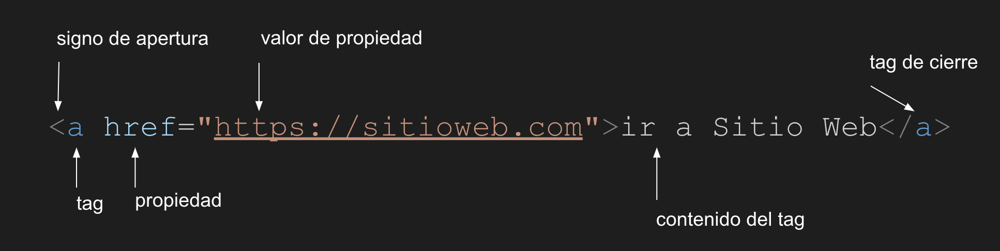

# Cursos HTML

HTML es un lenguaje de marcado que se utiliza para el desarrollo de páginas de Internet. Se trata de la siglas que corresponden a HyperText Markup Language, es decir, Lenguaje de Marcas de Hipertexto

## Definiciones

### Es un lenguaje

Tiene un set de reglas y acuerdos que se deben cumplir para que lo escrito sea válido y funcional

### Es de marcado

Una página HTML es un archivo de texto básico que contiene etiquetas(a veces denominado marcador, o tags en inglés) para formatos específicos de texto, imágenes, etc. La utilización de estas etiquetas se llama lenguaje de marcado.

### Es de Hipertexto

El hipertexto es una estructura no secuencial que permite crear, agregar, enlazar y compartir información de diversas fuentes por medio de enlaces asociativos y redes sociales

### Comentarios

Los comentarios html son textos que van dentro del código fuente pero que no son mostrados por los navegadores. Estos comentarios son muy útiles para los editores de la página, ya que ayudan a una mayor comprensión del código.

```html
<!-- Esto es un comentario -->
```

### Anatomia



| nombre             | descripción                                                                               |
|--------------------|:------------------------------------------------------------------------------------------|
| signo de apertura  | inicia con el signo menor que ´<´ seguido del nombre del tag                              |
| tag                | es el tipo etiqueta que se desea mostrar                                                  |
| propiedad          | dependiendo del tag, cada etiqueta tendrá diferentes opciones para configurar la etiqueta |
| valor de propiedad | la propiedad antes mencionada debe poseer un valor de configuración                       |
| contenido del tag  | sera texto o otros tag que tendrán aplicado las características que posean el tag         |
| tag de cierre      | indicativo para que la etiqueta finalice su funcionalidad                                 |

#### Mas ejemplos de etiquetas

```html

<!-- Etiquetas-->

<!-- Titulos, h1 hasta el h6, donde h1 mostrara un texto mas grande y h6 el mas pequeño -->

<h1>Titulo 1</h1>
<h2>Titulo 2</h2>
<h3>Titulo 3</h3>
<h4>Titulo 4</h4>
<h5>Titulo 5</h5>
<h6>Titulo 6</h6>

<!-- texto en negrita con strong -->
<strong>Texto en negrita</strong>

<!-- texto en cursiva con i -->
<i>Texto en negrita</i>

<!-- un parrafo con p -->
<p>Texto en negrita</p>

<!-- una imágen -->

<!-- este tag tiene muchas propiedades:
- src: url donde esta la imágen
- alt: texto que se mostrara si la imágen no esta disponible
- heigth: alto de la imágen
- width: el alto de la imágen
-->

<!-- Para crear una Cabecera sera con header -->
<header>Texto en negrita</header>

<!-- Para crer una lista tendremos que mezclar las etiquetas ul y li -->
<ul>
  <li>Cafe</li>
  <li>Té</li>
  <li>Leche</li>
</ul>
<!-- las etiquetas son:
- ul: unordered lists, lista no ordenada, creara una lista
- li: list item, item de lista
-->

<!-- input etiqueta para que loos usuarios puedan ingresar datos en la web -->
<input type="text" name="apellido" value="valor inicial" placeholder="Ingresa tu apellido" />
<!-- propiedades:
- type: sera el tipo de input, puede ser:
button
checkbox
color
date
datetime-local
email
file
hidden
image
month
number
password
radio
range
reset
search
submit
tel
text
time
url
week
- name: sera el nombre unico para luego poder recuperar la información ingresada
- value: sera el valor que tendra el input
- placeholder: es el texto de ayuda que se muestre
-->
```

#### Cierrer de tag

Es importante mencionar que algunas etiquetas se cierrar inmediatamente como el antes mencionado input, tambien pasara esto con etiquetas como `` y `<br />` (break, es un salto de linea)

#### Documento HTML basico

```html
<!DOCTYPE html> <!-- Obligatorio, indicamos que el documento es html-->
<html lang="es-CL"><!-- Obligatorio, etiqueta que contrendra todo el html -->
<!-- la propiedad lang sirve para especificar el idioma en el que esta escrito el documento -->

<head><!-- Obligatorio, etiqueta de apertura para indicar el sector donde se definen propiedades basicas del documento html-->
    <meta charset="UTF-8"><!-- Obligatorio, indicamos el tipo de codificación de los caracteres-->
    <meta name="viewport" content="width=device-width, initial-scale=1.0"><!-- Obligatorio, habilitamos la responsividad -->
    <title>Titulo del Documento</title><!-- Obligatorio, titulo que se muestra en la pestaña de la pagína -->
</head><!-- Obligatorio, -->

<body><!-- Obligatorio, -->
    <a href=”https://sitioweb.com”>Ir a Sitio Web</a><!-- -->
</body><!-- Obligatorio, -->

</html><!-- Obligatorio, -->
```
